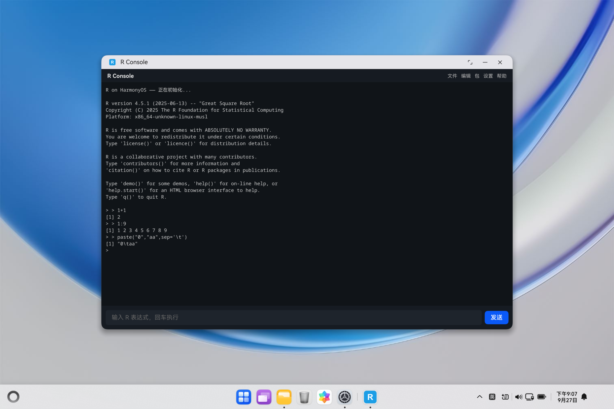

# R on OpenHarmony

> 将 CRAN **R 4.5.1** 交叉编译到 **HarmonyOS NEXT**（PC/2in1），封装为 HAP 应用，在设备上运行 R REPL。

[](https://www.r-project.org/)
[](https://www.openharmony.cn/)
[]()
[](https://www.r-project.org/Licenses/)

---

## 截图



## 概述

本项目实现了 R 语言运行时在鸿蒙系统上的完整移植链路：

1. **交叉编译** — 在 WSL2 中用 OpenHarmony NDK 将 R 4.5.1 编译为 `x86_64-unknown-linux-musl`（模拟器）和 `aarch64-unknown-linux-musl`（真机）目标
2. **HAP 封装** — 将编译产物打包进 HarmonyOS 应用，通过 ArkUI 终端 UI + NDK 原生桥在设备上运行嵌入式 R
3. **REPL 交互** — 用户在 HAP 界面输入 R 代码，实时获得求值结果

```
┌─────────────────────────────────────────────────────────┐
│                    HAP 应用 (com.example.ronohos)        │
│                                                         │
│  ┌───────────────────────────────────────────────────┐  │
│  │  ArkUI 终端页 (Index.ets)                         │  │
│  │  ┌─────────────────────────────────────────────┐  │  │
│  │  │  > 1 + 1                                    │  │  │
│  │  │  [1] 2                                      │  │  │
│  │  │  > library(stats)                           │  │  │
│  │  │  > sd(rnorm(10))                            │  │  │
│  │  │  [1] 0.9680378                              │  │  │
│  │  └─────────────────────────────────────────────┘  │  │
│  │  菜单栏: 文件 | 编辑 | 包 | 设置 | 帮助            │  │
│  └──────────────────────┬────────────────────────────┘  │
│                         │ pollOutput() (100ms 轮询)      │
│  ┌──────────────────────┴────────────────────────────┐$│8│
│  │  NDK 原生桥 (rhost.cpp)                           │  │
│  │  ├── dlopen("libR.so") → Rf_initEmbeddedR()      │  │
│  │  ├── R_ReplDLLinit() + R_ReplDLLdo1() 循环       │  │
│  │  ├── 17 个 ptr_R_* 回调设置                       │  │
│  │  ├── std::mutex 保护输出缓冲区                    │  │
│  │  └── sigsetjmp 拦截 exit()/SIGSEGV               │  │
│  └───────────────────────────────────────────────────┘  │
└─────────────────────────────────────────────────────────┘
```

## 功能特性

### ✅ 已实现

| 功能 | 状态 | 说明 |
|------|------|------|
| R 4.5.1 交叉编译 | ✅ | x86_64（模拟器）完整；aarch64（真机）构建链已打通 |
| REPL 基础交互 | ✅ | `1+1 → [1] 2`、变量赋值、算术运算、向量操作 |
| 嵌入式 R 引擎 | ✅ | dlopen libR.so + Rf_initEmbeddedR + R_ReplDLLdo1 循环 |
| 核心包加载 | ✅ | 9 个包 .so 预加载（stats/parallel/tools/grid/utils/splines/methods/grDevices/graphics） |
| stats 统计函数 | ✅ | `library(stats)` + `sd(rnorm(10)) = 0.968` + `date()` 等正常工作 |
| plot() 绘图 | ✅ | `plot(2,2)` 成功执行（graphics/grDevices 包已加载） |
| 菜单栏 | ✅ | 文件（运行脚本）/ 编辑 / 包（安装包）/ 设置 / 帮助 |
| 运行脚本 | ✅ | DocumentViewPicker 选文件 → source() 执行 |
| 安装包弹窗 | ✅ | 输入包名 → install.packages() |
| 输出轮询 | ✅ | setInterval 100ms 调 pollOutput() 取输出 |
| 信号拦截 | ✅ | sigsetjmp/siglongjmp 捕获 exit()/SIGSEGV |

### ⚠️ 已知限制

| 限制 | 根因 | 影响 |
|------|------|------|
| `system()` / `popen()` 不可用 | 鸿蒙 app 沙箱无 `/bin/sh`，`popen` 返回 EINVAL | 已通过覆盖 `Sys.which` 绕过；直接调 `system()` 的 R 代码仍不可用 |
| `q()` 退出可能崩溃 | R_CleanUp → exit(0) 被 appspawn 拦截为 SIGABRT | 退出应用时可能闪退 |
| CRAN 包安装编译 | 沙箱禁止 execv（EACCES） | install.packages() 编译型包不可用 |
| Tab 补全 / 历史记录 | 未实现 | 计划中 |

## 架构

### 编译链路

```
WSL2 Ubuntu
├── 00-host-r.sh        编译 host R（x86_64 Linux，构建期工具）
├── 10-deps.sh          交叉编译依赖（bzip2, xz, pcre2, readline, ...）
├── 20-f2c.sh           f2c（Fortran → C 转换器，NDK 无 Fortran 编译器）
├── 30-build-r.sh       交叉编译 R 4.5.1（configure + make）
├── 40-pack.sh          打包 rhome.tar（R 安装树 → ustar 归档）
└── 50-install-device.sh  hdc 推送到设备直跑（形态 A）
```

### HAP 应用结构

```
hap/
├── AppScope/
│   └── app.json5                    bundleName: com.example.ronohos
├── entry/
│   └── src/main/
│       ├── cpp/
│       │   ├── rhost.cpp            NDK 原生桥（核心 ~700 行）
│       │   └── CMakeLists.txt
│       ├── ets/
│       │   ├── pages/Index.ets      ArkUI 终端页
│       │   └── libentry.so.d.ts     native 模块类型声明
│       └── resources/
│           └── rawfile/rhome.tar    R 运行时（~60MB，构建时生成）
│   └── libs/x86_64/
│       ├── libR.so                  R 引擎（含 Rdynload patch）
│       ├── libomp.so                OpenMP 运行时
│       └── R/                       核心包 .so（可执行挂载点）
│           ├── library/{stats,utils,...}/libs/*.so
│           └── modules/{internet,lapack}.so
└── build-profile.json5             SDK 6.0.0(20) / 6.1.1(24)
```

### 核心技术决策

| 难点 | 方案 |
|------|------|
| NDK 无 Fortran 编译器 | f2c 将 Fortran 源码转 C，再用 clang 编译 |
| R 官方不支持交叉编译 | 两阶段构建：host R（构建期脚本）+ target R（交叉编译） |
| musl libc | 交叉编译 bzip2/xz/pcre2/readline；zlib 用 sysroot 自带 |
| 沙箱禁止 fork/exec | 主进程内起线程运行 R（非子进程） |
| Rf_mainloop 定时器 segfault | 用 R_ReplDLLinit + R_ReplDLLdo1 循环替代 |
| Node-API threadsafe function bug | 改用轮询机制（mutex + setInterval pollOutput） |
| exit() 被 appspawn 拦截 | sigsetjmp/siglongjmp + signal(SIGABRT) 拦截 |
| stub libz.so | 删除 SDK 的 stub libz.so，让 linker 找设备上的真 libz.so |
| app-data 目录 noexec | 包 .so 放 HAP libs 可执行挂载点 + patch Rdynload.c remapDLLPath |
| `system()` EINVAL（无 /bin/sh） | R 初始化后用 C API 覆盖 `Sys.which` 返回空字符串 |

## 快速开始

### 前置条件

- **WSL2 Ubuntu** — 交叉编译环境
- **OpenHarmony SDK**（Linux 版）— NDK 工具链
- **DevEco Studio 6.x** — HAP 构建与安装
- **HarmonyOS 模拟器或真机** — 运行目标

### 一、交叉编译 R（首次约 30–60 分钟）

```bash
# 在 WSL2 Ubuntu 中
cd /mnt/c/path/to/r-on-ohos/build
export OHOS_NDK=/opt/ohos-sdk          # OpenHarmony SDK 路径

# 模拟器（x86_64）
OHOS_ARCH=x86_64 ./all.sh

# 真机（aarch64）
./all.sh
```

产物：`build/out/r-ohos-x86_64/rhome.tar`（R 安装树，~52MB）

### 二、构建 HAP

```bash
# 将 rhome.tar 复制到 HAP 工程
cp build/out/r-ohos-x86_64/rhome.tar hap/entry/src/main/resources/rawfile/

# 用 DevEco Studio 打开 hap/ 工程，或命令行：
cd hap
hvigorw --mode module -p product=default -p module=entry@default assembleHap
```

产物：`entry/build/default/outputs/default/entry-default-unsigned.hap`

### 三、安装运行

```bash
# 安装到模拟器/真机
hdc install entry-default-unsigned.hap

# 启动应用（手动点击图标，或）
hdc shell aa start -a EntryAbility -b com.example.ronohos
```

### 四、直接在设备上跑 R（形态 A，无需 HAP）

```bash
cd build
./50-install-device.sh    # hdc 推送 rhome.tar 到 /data/local/tmp 并解压
# 在 hdc shell 中：
cd /data/local/tmp/r-ohos-x86_64
./R --vanilla --interactive
```

## 预构建 HAP

仓库根目录包含预构建的 HAP 包：

```
entry-default-unsigned.hap    # ~60MB，x86_64 模拟器版本
```

直接 `hdc install entry-default-unsigned.hap` 即可安装体验。

## 目录结构

```
r-on-ohos/
├── build/                 交叉编译脚本（WSL2 中运行）
│   ├── 00-host-r.sh       host R 编译
│   ├── 10-deps.sh         依赖库交叉编译
│   ├── 20-f2c.sh          f2c Fortran→C 转换器
│   ├── 30-build-r.sh      R 4.5.1 交叉编译
│   ├── 40-pack.sh         rhome.tar 打包
│   ├── 50-install-device.sh  设备安装
│   ├── all.sh             一键构建
│   ├── env.sh             环境变量
│   ├── config.site.ohos   configure 站点配置
│   ├── ohos.toolchain.cmake  CMake 工具链文件
│   └── ...
├── docs/                  移植技术文档
│   ├── 01-技术路线与可行性.md
│   ├── 02-环境准备.md
│   ├── 03-交叉编译R指南.md
│   ├── 04-HAP应用封装指南.md
│   └── 05-已知问题与路线图.md
├── hap/                   DevEco Studio 工程（HAP 应用）
│   ├── AppScope/
│   ├── entry/
│   │   └── src/main/
│   │       ├── cpp/rhost.cpp      NDK 原生桥（核心）
│   │       ├── ets/pages/Index.ets  ArkUI 终端页
│   │       └── resources/rawfile/  R 运行时（构建时生成）
│   └── build-profile.json5
├── patches/               源码补丁说明
├── entry-default-unsigned.hap  预构建 HAP（x86_64 模拟器）
├── HANDOFF.md             交接文档
└── README.md
```

## 技术文档

详细的技术路线、环境准备、编译指南和问题清单见 `docs/`：

- [01 - 技术路线与可行性](docs/01-技术路线与可行性.md)
- [02 - 环境准备](docs/02-环境准备.md)
- [03 - 交叉编译 R 指南](docs/03-交叉编译R指南.md)
- [04 - HAP 应用封装指南](docs/04-HAP应用封装指南.md)
- [05 - 已知问题与路线图](docs/05-已知问题与路线图.md)

## 路线图

- [x] R 4.5.1 交叉编译（x86_64 + aarch64）
- [x] HAP 应用 REPL 交互（`1+1 → [1] 2`）
- [x] 菜单栏 + 运行脚本 + 安装包弹窗
- [x] **核心包 .so 加载**（stats/tools/utils 等 9 个包，remapDLLPath + 预加载）
- [x] **stats 统计函数**（`sd(rnorm(10)) = 0.968`，`date()` 等）
- [x] **plot() 绘图**（`plot(2,2)` 成功执行）
- [ ] `source()` 完整可用（基础 source 已工作，外部脚本路径待验证）
- [ ] Tab 键补全
- [ ] 上下键输入历史
- [ ] aarch64 真机验证

## 参考项目

### [ohos_rstudio](https://atomgit.com/OpenHarmonyPCDeveloper/ohos_rstudio) — R + Qt for OpenHarmony

本项目在包 .so 加载方案上参考了 ohos_rstudio（R 4.6.1 + Qt for OpenHarmony）的以下关键技术：

| 技术点 | ohos_rstudio 方案 | 本项目采纳情况 |
|--------|-------------------|----------------|
| **Rdynload.c patch** | 添加 `remapDLLPath()` — dlopen 从 R_HOME（app-data noexec）失败时重映射到 `R_NATIVE_LIBRARY_ROOT`（HAP 原生库目录，可执行） | ✅ 采纳，通过 `patch-rdynload.py` 在编译前 patch R 源码 |
| **main.c patch** | `__OHOS__` 宏禁用 JIT bootstrap（`R_jit_enabled = 0`） | ✅ 采纳 |
| **包 .so 放置位置** | HAP 原生库目录 `libs/<abi>/R/library/`（可执行挂载点），非 app-data | ✅ 采纳，通过 CMake `copy_directory` 打包进 HAP |
| **R_NATIVE_LIBRARY_ROOT** | 环境变量指向原生库目录的 R 树 | ✅ 采纳 |
| **预加载策略** | `RTLD_LAZY \| RTLD_GLOBAL` 预加载所有依赖 .so | ✅ 采纳 |
| **JIT/字节码禁用** | `R_ENABLE_JIT=0`、`R_DISABLE_BYTECODE=1`、`_R_COMPILE_PKGS_=0` | ✅ 采纳 |

### 本项目独立解决的部分

| 问题 | 方案 |
|------|------|
| `system()` EINVAL（app 沙箱无 `/bin/sh`） | R 初始化后用 R C API（`R_ParseVector` + `Rf_eval`）注入 `unlockBinding` + `assign` 覆盖 `Sys.which` 返回空字符串 |
| `assignInNamespace` 不可用 | `R_DEFAULT_PACKAGES=base` 时 utils 包未加载，改用 base 自带 `unlockBinding` + `assign` + `lockBinding` |
| Node-API threadsafe function bug | 改用轮询机制（`std::mutex` + `setInterval pollOutput`） |
| `Rf_mainloop` 定时器 segfault | 用 `R_ReplDLLinit` + `R_ReplDLLdo1` 循环替代 |
| stub libz.so | 删除 SDK stub，让 linker 找设备真 libz.so |

## 许可证

R 以 **GPL-2/GPL-3** 发布。二次分发请保留许可证与源码获取途径。

本项目代码（构建脚本、HAP 工程骨架、原生桥）以 MIT 许可证发布，但编译产物中的 R 运行时遵循 R 的 GPL 许可证。
